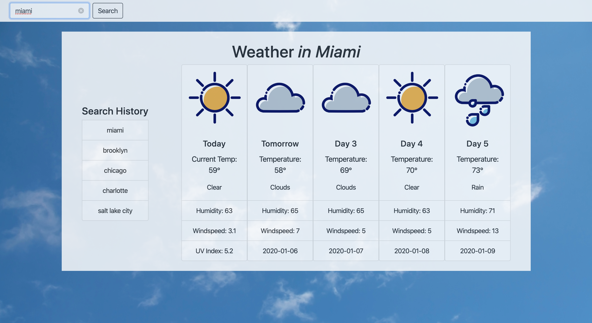
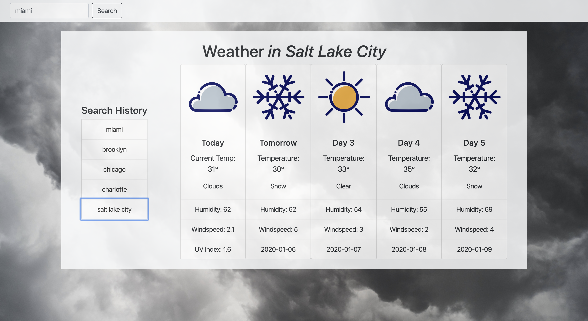
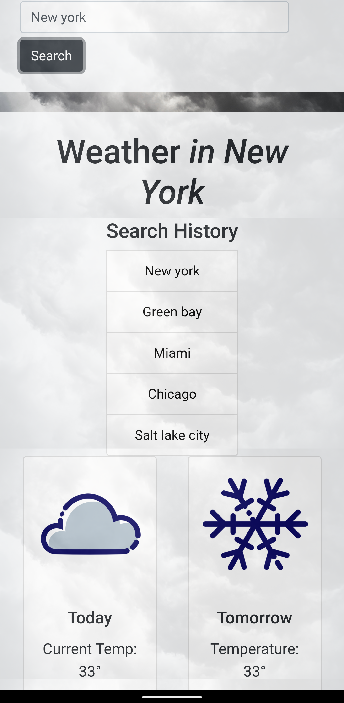
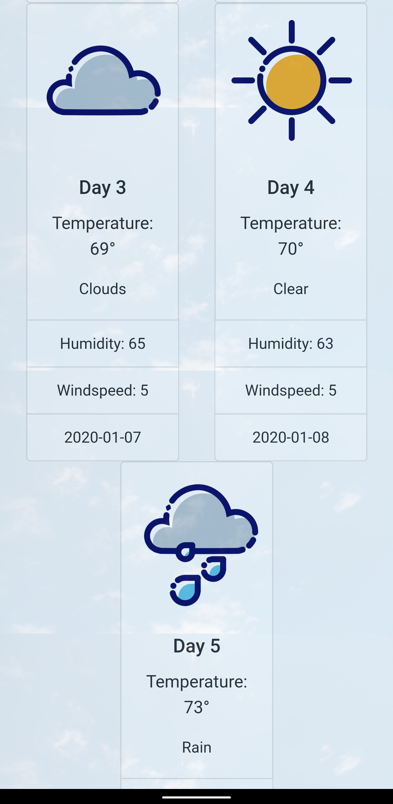

# 5 Day Forecast Project
Here is my 5 day forecast project with functioning search bar and 5 city search history. It shows the Date, Weather icons, temperatures, Humidity, windspeed, and UV-Index. I created it with JQuery, JavaScript, HTML, and CSS. 
  

##  Links
Git Pages
https://rythomas2525.github.io/weather/
Git Hub Repository
https://github.com/rythomas2525/weather
Portfolio w/ Weather added
https://rythomas2525.github.io/hw2responsiveportfolio/portfolio.html

## Screenshots

## Developed by Ryan Thomas
